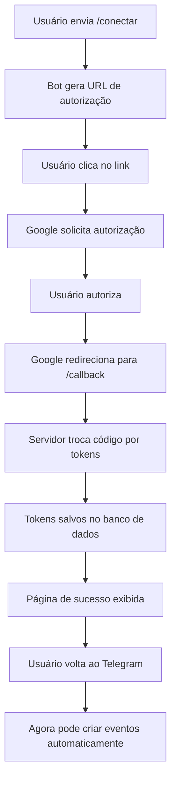

# 🚀 Implementação Google Calendar - Concluída

## ✅ O que foi implementado

### 1. **Rotas de Autenticação OAuth 2.0** (`server/routes/google-auth.routes.ts`)
- ✅ `GET /api/auth/google/authorize` - Gera URL de autorização
- ✅ `GET /api/auth/google/callback` - Processa callback do Google
- ✅ `POST /api/auth/google/disconnect` - Desconecta Google Calendar
- ✅ `GET /api/auth/google/status` - Verifica status da conexão

### 2. **Comandos no Telegram Bot** (`server/telegram/direct_bot.ts`)
- ✅ `/conectar` - Conecta Google Calendar (gera link de autorização)
- ✅ `/desconectar` - Desconecta Google Calendar
- ✅ `/status` - Mostra status da conexão
- ✅ Menu de comandos atualizado com novos comandos

### 3. **Middleware e Configurações**
- ✅ Rotas registradas no `server/routes.ts`
- ✅ Middleware de erro (`asyncHandler`) já implementado
- ✅ Biblioteca `googleapis` instalada

### 4. **Variáveis de Ambiente**
- ✅ `GOOGLE_CLIENT_ID` - Adicionado ao `env.example`
- ✅ `GOOGLE_CLIENT_SECRET` - Adicionado ao `env.example`
- ✅ `GOOGLE_REDIRECT_URI` - Adicionado ao `env.example`
- ✅ `BASE_URL` - Adicionado ao `env.example`

---

## 📋 O que você precisa fazer agora

### **Passo 1: Adicionar credenciais no arquivo `.env`**

Abra seu arquivo `.env` (se não existir, copie o `env.example`) e adicione:

```env
# =================== GOOGLE CALENDAR ===================
GOOGLE_CLIENT_ID=seu_client_id_aqui.apps.googleusercontent.com
GOOGLE_CLIENT_SECRET=sua_secret_aqui
GOOGLE_REDIRECT_URI=http://localhost:8080/api/auth/google/callback

# =================== SERVIDOR ===================
BASE_URL=http://localhost:8080
```

### **Passo 2: Obter credenciais do Google Cloud Console**

1. Acesse [Google Cloud Console](https://console.cloud.google.com/)
2. Selecione seu projeto (ou crie um novo)
3. Vá em **APIs e Serviços** → **Credenciais**
4. Clique em **Criar Credenciais** → **ID do cliente OAuth 2.0**
5. Configure:
   - **Tipo de aplicativo:** Aplicativo da Web
   - **Origens JavaScript autorizadas:**
     - `http://localhost:8080`
   - **URIs de redirecionamento autorizados:**
     - `http://localhost:8080/api/auth/google/callback`
6. Copie o **ID do cliente** e o **Segredo do cliente**
7. Cole no arquivo `.env`

### **Passo 3: Configurar URIs de Redirecionamento**

No Google Cloud Console, certifique-se de adicionar as URIs:

**Para Desenvolvimento:**
```
http://localhost:8080/api/auth/google/callback
```

**Para Produção (quando fizer deploy):**
```
https://seu-dominio.com/api/auth/google/callback
```

⚠️ **IMPORTANTE:** Atualize a `GOOGLE_REDIRECT_URI` e `BASE_URL` no `.env` de produção!

### **Passo 4: Ativar API do Google Calendar**

1. No Google Cloud Console
2. **APIs e Serviços** → **Biblioteca**
3. Procure por "Google Calendar API"
4. Clique em **Ativar**

---

## 🧪 Como testar

### **Teste 1: Verificar se o servidor está funcionando**

```bash
npm start
```

Deve aparecer:
```
✅ Servidor rodando na porta 8080
✅ Telegram Bot conectado
✅ WhatsApp Bot conectado
```

### **Teste 2: Comando /conectar no Telegram**

1. Abra o Telegram
2. Envie `/conectar` para o bot
3. Clique no botão "🔗 Conectar Google Calendar"
4. Autorize o acesso no Google
5. Você será redirecionado para uma página de sucesso
6. Volte ao Telegram e envie `/status` - deve mostrar "✅ Google Calendar Conectado"

### **Teste 3: Criar evento automaticamente**

1. No Telegram, envie: `reunião teste amanhã às 15h`
2. O bot deve processar e criar o evento
3. **SE CONECTADO AO GOOGLE CALENDAR**, o evento será criado automaticamente no seu calendário!
4. Verifique no Google Calendar se o evento apareceu

---

## 🎯 Fluxo de Funcionamento



---

## 🔧 Solução de Problemas

### ❌ "Google Calendar OAuth não configurado"
**Solução:** Adicione `GOOGLE_CLIENT_ID` e `GOOGLE_CLIENT_SECRET` no `.env`

### ❌ "redirect_uri_mismatch"
**Solução:** 
1. Verifique se a URI no Google Cloud Console está exatamente:
   ```
   http://localhost:8080/api/auth/google/callback
   ```
2. Confira se `GOOGLE_REDIRECT_URI` no `.env` está igual

### ❌ "access_denied"
**Solução:** Usuário cancelou autorização. Peça para enviar `/conectar` novamente.

### ❌ "invalid_client"
**Solução:** Credenciais inválidas. Verifique `GOOGLE_CLIENT_ID` e `GOOGLE_CLIENT_SECRET`

### ❌ Evento não é criado automaticamente
**Solução:**
1. Verifique se usuário está conectado: `/status`
2. Se não, peça para enviar `/conectar`
3. Verifique se Google Calendar API está ativada no Google Cloud
4. Cheque os logs do servidor para erros

---

## 📊 Status de Implementação

| Componente | Status | Descrição |
|-----------|--------|-----------|
| OAuth Routes | ✅ | Rotas de autenticação implementadas |
| Telegram Commands | ✅ | /conectar, /desconectar, /status |
| WhatsApp Commands | ⏳ | Pendente (opcional) |
| Event Creation | ✅ | Código em `googleCalendarIntegration.ts` |
| Token Refresh | ✅ | Refresh automático implementado |
| Database Schema | ✅ | Tabela `user_settings` com `google_tokens` |
| Error Handling | ✅ | Middleware de erro configurado |
| Documentation | ✅ | Guia completo disponível |

---

## 🎉 Próximos Passos (Após Configurar)

1. ✅ Testar fluxo completo de OAuth
2. ✅ Criar evento de teste e verificar no Google Calendar
3. ⏳ Implementar comandos no WhatsApp (opcional)
4. ⏳ Adicionar suporte para Google Meet automático
5. ⏳ Implementar sistema de lembretes (próxima prioridade 🔥)

---

## 📝 Notas Importantes

- ⚠️ **Produção:** Ao fazer deploy, atualize `BASE_URL` e `GOOGLE_REDIRECT_URI` com domínio real
- 🔒 **Segurança:** NUNCA commite o arquivo `.env` (já está no `.gitignore`)
- 🔄 **Tokens:** Os tokens são salvos criptografados no banco de dados
- 🕒 **Refresh:** Os tokens são renovados automaticamente quando expiram
- 📅 **Escopo:** Apenas permissão para criar eventos (não delete ou edit outros eventos)

---

## 💡 Dicas

1. **Teste localmente primeiro** antes de fazer deploy
2. **Use ngrok** se quiser testar o OAuth callback em ambiente local sem expor seu IP:
   ```bash
   ngrok http 8080
   ```
   Depois use a URL do ngrok como `BASE_URL` e adicione no Google Cloud Console

3. **Logs são seus amigos:** Cheque o console do servidor para ver o que está acontecendo

4. **Teste com conta pessoal:** Use sua conta pessoal do Google para testar antes de liberar para usuários

---

## 🤝 Suporte

Se encontrar problemas:
1. Verifique os logs do servidor
2. Confirme que todas as variáveis de ambiente estão configuradas
3. Teste cada comando individualmente (`/status`, `/conectar`, etc.)
4. Verifique se Google Calendar API está ativada
5. Confirme que redirect URIs estão corretas

---

**Implementação realizada por:** GitHub Copilot  
**Data:** Janeiro 2025  
**Versão:** 1.0
